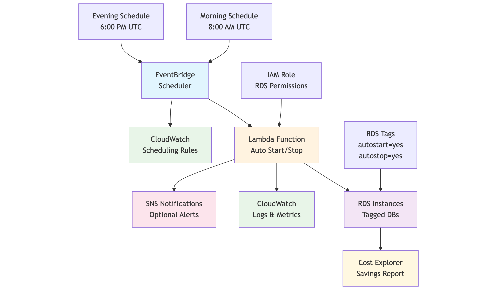

# RDS Auto Start/Stop Lambda

Automatically start and stop RDS instances based on EventBridge schedules to optimize costs for non-production workloads.

## Features

- **Auto Start/Stop**: Manages RDS instances based on tags and schedule
- **Cost Optimization**: Reduce costs by up to 70% for dev/test environments
- **Flexible Scheduling**: Configure custom start/stop times via EventBridge
- **Tag-Based Control**: Uses `autostart=yes` and `autostop=yes` tags
- **Comprehensive Logging**: CloudWatch integration for monitoring

## Architecture



## Quick Setup

### 1. Deploy Lambda Function

1. **Create Function:**
   - Function name: `rds-auto-startstop`
   - Runtime: Python 3.x
   - Timeout: 5 minutes

2. **Add IAM Permissions:**
```json
{
  "Version": "2012-10-17",
  "Statement": [
    {
      "Effect": "Allow",
      "Action": [
        "rds:DescribeDBInstances",
        "rds:ListTagsForResource",
        "rds:StartDBInstance",
        "rds:StopDBInstance"
      ],
      "Resource": "*"
    }
  ]
}
```

3. **Deploy Code:** Upload the provided Lambda function code

### 2. Tag RDS Instances

Add tags to your RDS instances:
- **For auto-start**: `autostart = yes`
- **For auto-stop**: `autostop = yes`

**Important:** Only tag non-production instances that can be safely stopped.

### 3. Configure EventBridge Rules

#### Stop Rule (Evening)
- **Name:** `rds-auto-stop-evening`
- **Schedule:** `cron(0 18 * * ? *)` (6 PM UTC daily)
- **Target:** Your Lambda function
- **Input:**
```json
{
  "detail": {
    "action": "stop"
  }
}
```

#### Start Rule (Morning)
- **Name:** `rds-auto-start-morning`
- **Schedule:** `cron(0 8 * * ? *)` (8 AM UTC daily)
- **Target:** Your Lambda function
- **Input:**
```json
{
  "detail": {
    "action": "start"
  }
}
```

## Usage Examples

### Business Hours Schedule
- **Start:** Monday-Friday 8 AM UTC
- **Stop:** Monday-Friday 6 PM UTC
- **Savings:** ~50-70% cost reduction

### Development Environment
- **Start:** Weekdays 9 AM local time
- **Stop:** Weekdays 7 PM local time
- **Weekend:** Completely stopped

## Testing

1. **Manual Test:**
```bash
aws lambda invoke \
  --function-name rds-auto-startstop \
  --payload '{"detail":{"action":"stop"}}' \
  response.json
```

2. **Verify in Console:**
   - Check RDS instance status
   - Review CloudWatch logs
   - Monitor EventBridge rule execution

## Important Notes

- **7-Day Limit:** AWS automatically restarts stopped instances after 7 days
- **Multi-AZ:** Some configurations (SQL Server Multi-AZ) cannot be stopped
- **Read Replicas:** Instances with read replicas cannot be stopped
- **Timezone:** All cron expressions use UTC time

## Monitoring

- **CloudWatch Logs:** Lambda execution details
- **CloudWatch Metrics:** Success/failure rates
- **Cost Explorer:** Track savings over time
- **SNS Notifications:** Optional alerts for failures

## Cost Impact

Typical savings by environment type:
- **Development:** 50-70% reduction
- **Testing:** 70-85% reduction
- **Training:** 80-90% reduction

*Savings depend on your specific usage patterns and schedule configuration.*